# AWS Stock Market Streaming Pipeline

# 1. Visión General del Proyecto

Este proyecto implementa un **pipeline de analítica de datos en tiempo casi real (near real-time)** utilizando **servicios serverless y orientados a eventos de AWS**, con el objetivo de ingerir, procesar, almacenar y analizar datos del mercado bursátil de manera eficiente y con conciencia de costos.

El sistema simula un escenario real de **ingesta continua de datos**, donde un productor local obtiene información actualizada del mercado desde una fuente externa y la transmite a la nube mediante un servicio de streaming administrado. A partir de este punto, la arquitectura permite el procesamiento automático de los eventos, el almacenamiento diferenciado de los datos según su propósito y la posibilidad de generar alertas ante cambios relevantes.

Aunque el dominio de aplicación corresponde al **mercado de valores**, el foco principal del proyecto no es financiero, sino **arquitectónico**. La solución está diseñada como una arquitectura de referencia que puede adaptarse fácilmente a otros tipos de datos, como señales biomédicas (por ejemplo, EEG), datos de sensores IoT, telemetría industrial o registros de sistemas. De esta forma, el proyecto sirve como una introducción práctica al diseño de **pipelines modernos de datos en la nube**.

El objetivo central es aplicar y consolidar principios fundamentales de **Cloud Architecting**, tales como:
- Arquitecturas orientadas a eventos (event-driven)
- Computación serverless
- Componentes desacoplados
- Separación del almacenamiento según el propósito
- Escalabilidad y elasticidad
- Optimización de costos bajo el modelo de pago por uso

Todo ello minimizando la gestión manual de infraestructura y la complejidad operativa.

---

# 2. Visión General de la Arquitectura

La arquitectura del proyecto sigue un **enfoque orientado a eventos**, en el cual cada nuevo dato se trata como un evento independiente que fluye a través de distintos servicios administrados de AWS. No existen servidores dedicados ni procesos persistentes en la nube; en su lugar, la solución se apoya completamente en servicios que reaccionan automáticamente a la llegada de nuevos eventos.

El flujo inicia con un **productor de datos local**, implementado en Python, que consulta periódicamente información del mercado bursátil desde Yahoo Finance. Cada lectura se transforma en un evento estructurado en formato JSON y se envía a **Amazon Kinesis Data Streams**, el cual actúa como el eje central de streaming del sistema. Kinesis permite desacoplar la generación de datos de su procesamiento, garantizando escalabilidad y tolerancia a picos de carga.

Una vez que los eventos ingresan al stream, **AWS Lambda** los consume de manera automática. Estas funciones serverless se encargan de validar, transformar y realizar análisis básicos sobre los datos, sin necesidad de aprovisionar servidores ni gestionar escalamiento. Los datos procesados, destinados a consultas rápidas, se almacenan en **Amazon DynamoDB**, mientras que los datos crudos se archivan en **Amazon S3**, conformando un data lake para análisis posteriores.

Para el análisis histórico y exploratorio, **Amazon Athena** permite ejecutar consultas SQL directamente sobre los archivos almacenados en S3, eliminando la necesidad de bases de datos analíticas dedicadas. Finalmente, cuando se detectan patrones o cambios significativos en los datos, el sistema puede emitir notificaciones en tiempo casi real mediante **Amazon SNS**, integrándose con servicios de correo electrónico o mensajería.

En conjunto, la arquitectura prioriza:
- Escalabilidad automática
- Alta disponibilidad
- Baja complejidad operativa
- Eficiencia de costos mediante servicios serverless

lo que la hace adecuada para escenarios de analítica en tiempo casi real dentro del ecosistema AWS.


---

# 3. Desarrollo del Proyecto

En esta sección se describe el desarrollo progresivo del pipeline de datos, detallando cada una de las etapas implementadas y las decisiones técnicas adoptadas. El objetivo es mostrar cómo la arquitectura presentada previamente se materializa en componentes concretos, integrados de forma incremental y coherente.

Cada subsección aborda un bloque funcional del sistema, comenzando por la ingesta de datos en tiempo casi real y avanzando hacia el procesamiento, almacenamiento, análisis y notificación de eventos.

---

## 3.1 Ingesta de Datos en Tiempo Casi Real con Amazon Kinesis

La primera etapa del desarrollo del pipeline consiste en habilitar la **ingesta continua de datos en tiempo casi real**, la cual constituye la base de toda la arquitectura orientada a eventos. En esta fase se configura un stream de Amazon Kinesis y se implementa un productor local en Python encargado de enviar datos del mercado bursátil hacia la nube de forma periódica.

Esta etapa se divide en cuatro pasos principales: la creación del stream de Kinesis, la preparación del entorno local, la implementación del script productor y la verificación del flujo de datos.

---

### 3.1.1 Creación del Kinesis Data Stream

El primer paso consiste en crear un **Amazon Kinesis Data Stream**, el cual actuará como el punto de entrada central de los datos hacia AWS. Kinesis es un servicio administrado que permite capturar y procesar grandes volúmenes de datos de streaming con baja latencia, facilitando el desacoplamiento entre productores y consumidores.

Para este proyecto, el stream se configura en **modo on-demand**, lo que elimina la necesidad de gestionar shards manualmente y permite que el servicio escale automáticamente según la carga.

**Configuración realizada:**
- **Stream name:** `stock-market-stream`
- **Capacity mode:** On-demand
- **Retention period:** 24 horas (valor por defecto)

Una vez creada la configuración, el stream queda disponible para comenzar a recibir eventos desde el productor local.


---

### 3.1.2 Preparación del Entorno Local en Python

Con el stream de Kinesis listo, el siguiente paso es preparar el **entorno local de desarrollo**, el cual será responsable de obtener los datos del mercado bursátil y enviarlos al stream.

Se utiliza **Python 3.8 o superior**
```bash
python --version
```
junto con las siguientes dependencias:
- `boto3`: SDK de AWS para Python, utilizado para interactuar con Kinesis.
- `yfinance`: biblioteca para obtener datos actualizados del mercado bursátil desde Yahoo Finance.

De preferencia creamos un entorno virtual:
```bash
python -m venv venv_stock_market_real_time
source venv venv_stock_market_real_time/bin/activate
```
Luego instalamos las librerias requeridas:
```bash
pip install boto3 yfinance
```

Asimismo, se configura la **autenticación con AWS** mediante AWS CLI, lo que permite que el SDK boto3 utilice de forma automática las credenciales del usuario para enviar datos al stream.
En un sistema operativo linux, hacemos:
```bash
sudo apt update
sudo apt install -y curl unzip
```
Descargamos AWS CLI v2(oficial)
```bash
curl "https://awscli.amazonaws.com/awscli-exe-linux-x86_64.zip" -o "awscliv2.zip"
```

Descomprimimos e instalamos:
```bash
unzip awscliv2.zip
sudo ./aws/install
```


Creamos un usuario, configuramos los permisos y descargamos el Access key ID y el  Secret access key para hacer:


```bash
aws configure
```


Este paso asegura que el entorno local tenga:
- Acceso autenticado a AWS.
- Permisos suficientes para interactuar con Amazon Kinesis.
- Dependencias necesarias para la obtención y envío de datos.

---

### 3.1.3 Implementación del Script Productor de Datos

Una vez configurado el entorno, se implementa un **script productor en Python** encargado de obtener datos del mercado bursátil y enviarlos continuamente a Amazon Kinesis.

El script realiza las siguientes tareas:
1. Consulta datos del símbolo bursátil `AAPL` utilizando la biblioteca `yfinance`.
2. Obtiene información relevante como precios de apertura, máximo, mínimo, cierre, volumen y cierre previo.
3. Calcula métricas básicas como el cambio absoluto y el porcentaje de variación.
4. Estructura la información en un objeto JSON que incluye una marca temporal en UTC.
5. Envía el evento al stream de Kinesis utilizando `put_record`, empleando el símbolo bursátil como **Partition Key** para preservar el orden de los eventos.

**Python streaming script:**  
[`stream_kinesis.py`](src/stream_stock_data_refactoring.py)

El script se ejecuta en un bucle infinito con un intervalo de 30 segundos entre envíos, simulando un flujo continuo de datos en tiempo casi real.

---

### 3.1.4 Ejecución y Verificación del Flujo de Datos

Finalmente, se ejecuta el script productor desde la terminal para comenzar el envío de datos hacia Amazon Kinesis. Cada ejecución genera un nuevo evento que es enviado al stream y confirmado mediante la respuesta del servicio.

Durante la ejecución, el script imprime en consola:
- El contenido del evento enviado.


- La respuesta de Kinesis, incluyendo el `ShardId`, el `SequenceNumber` y el código HTTP 200, indicando un envío exitoso.


Para verificar que los datos están llegando correctamente a AWS, se utiliza la consola de Amazon Kinesis, revisando:
- Las métricas de **Incoming Records** en la sección *Monitoring*.
- Opcionalmente, el **Data Viewer** para inspeccionar los registros almacenados en los shards.


Es importante detener manualmente la ejecución del script utilizando `CTRL + C` cuando no se requiera continuar enviando datos, ya que mantener el productor activo de forma indefinida nos puede generar costos innecesarios.


---

Con esta etapa se completa la ingesta de datos en tiempo casi real, dejando el pipeline preparado para que servicios posteriores, como AWS Lambda, consuman los eventos del stream y continúen con el procesamiento y almacenamiento de la información.

---

## 3.2 Procesamiento de Datos con AWS Lambda (Kinesis → DynamoDB + S3)

En esta etapa se implementa el procesamiento automático de los eventos que llegan a **Amazon Kinesis Data Streams**. En lugar de almacenar directamente los datos tal como llegan, se utiliza **AWS Lambda** como componente serverless para transformar la información, calcular métricas útiles y separar el almacenamiento según el propósito:

- **Amazon S3**: conserva los datos **crudos** (raw) como respaldo e historial.
- **Amazon DynamoDB**: almacena datos **procesados y estructurados** para consultas de baja latencia.

El resultado es un flujo desacoplado y escalable: el productor envía eventos al stream, y Lambda los consume en lotes (batch=2) para persistirlos y enriquecerlos sin necesidad de administrar servidores.

Pasos a seguir:

- Crear una tabla de **DynamoDB** para almacenar los datos procesados.
- Crear **S3** para almacenar los datos sin procesar.
- Configurar **AWS Lambda** en la consola de AWS.
- Probar la integración.

---

### 3.2.1 Crear tabla DynamoDB para datos procesados

En este paso, procesaremos los datos entrantes usando **AWS Lambda** y almacenaremos registros estructurados en **Amazon DynamoDB** para realizar consultas en tiempo real.

**¿Por qué necesitamos una tabla de DynamoDB?**

Una base de datos NoSQL como DynamoDB es ideal para gestionar datos bursátiles en tiempo real gracias a sus siguientes características:

- Rápidas operaciones de lectura y escritura: garantizan consultas de baja latencia.
- Esquema flexible: permite ajustar fácilmente los campos de datos bursátiles.
- Escalabilidad: gestiona transacciones bursátiles de gran volumen de forma eficiente.

En lugar de almacenar los precios brutos de las acciones, **AWS Lambda** procesará los datos antes de guardarlos en DynamoDB, este enfoque nos permite:

- Estructurar los datos para una rápida recuperación.
- Calcular métricas bursátiles como cambios de precio y medias móviles.
- Detectar anomalías en los movimientos bursátiles.

**¿Qué se almacenará en DynamoDB?**

La función Lambda procesará los siguientes campos clave de datos bursátiles antes de almacenarlos en DynamoDB:

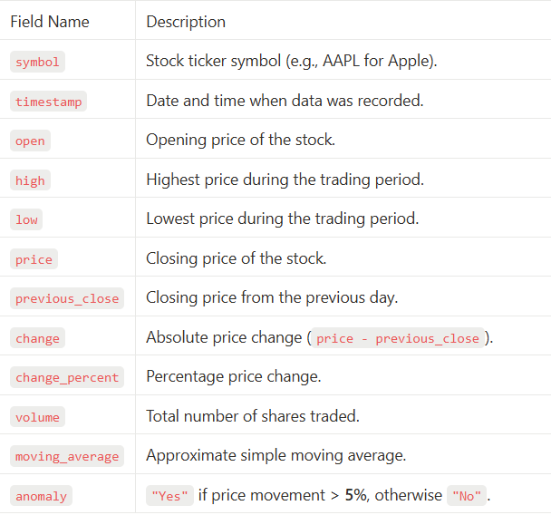

Crearemos la tabla **DynamoDB**  en **AWS Console**:
- Open the **AWS Console** -> Navigate to **DynamoDB**.

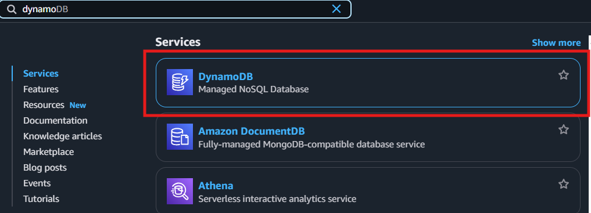

- Click Create Table.
- **Table name:** `stock-market-data`
- **Partition key:** `symbol` (String)
- **Sort key:** `timestamp` (String)

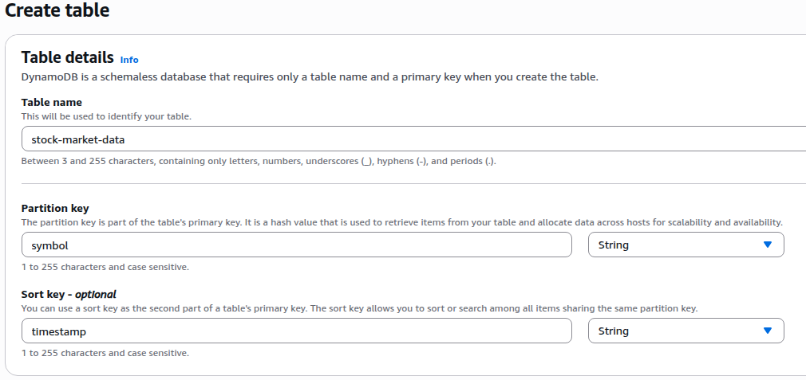

- Keep the rest of the configurations as default.
- Click Create Table.

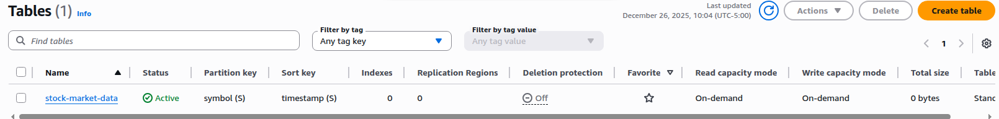

---

### 3.2.2 Crear bucket S3 para almacenar datos crudos

Se creó un bucket en Amazon S3 para archivar los eventos en formato JSON antes de su procesamiento final. Este almacenamiento es útil para:
- auditoría y trazabilidad (mantener “raw truth”)
- análisis histórico posterior (Athena)
- potencial re-procesamiento o batch processing
- Procesamiento por lotes, útil para entrenar modelos de aprendizaje automático sobre tendencias bursátiles.

Crearemos un **S3** bucket:
- Open AWS Console -> Navigate to S3.


- Click Create bucket.
- Bucket Name: Enter a unique name, e.g., `stock-market-data-bucket-1996`.
- Region: Choose the same region as your Lambda function.
- Keep default settings (Block Public Access enabled).
- Click Create bucket.

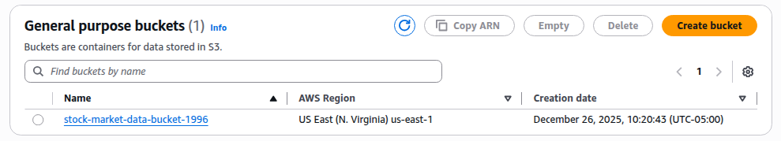

Los objetos se guardan con una estructura jerárquica por símbolo y timestamp:
- `raw-data/<symbol>/<timestamp>.json`

---

### 3.2.3 Crear rol IAM para AWS Lambda

Antes de crear la función, se configuró un rol IAM para otorgar permisos de lectura/escritura a los servicios involucrados. Para replicar el laboratorio se adjuntaron políticas administradas:
- Open AWS Console -> Navigate to IAM.

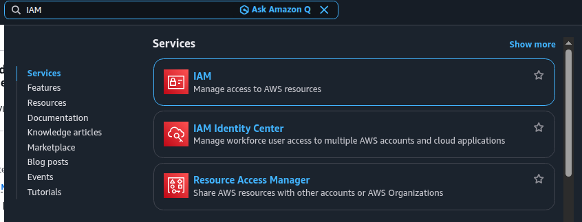

- Click Roles -> Create Role.
- Trusted Entity Type: Select AWS Service.
- Use Case: Choose Lambda -> Click Next.

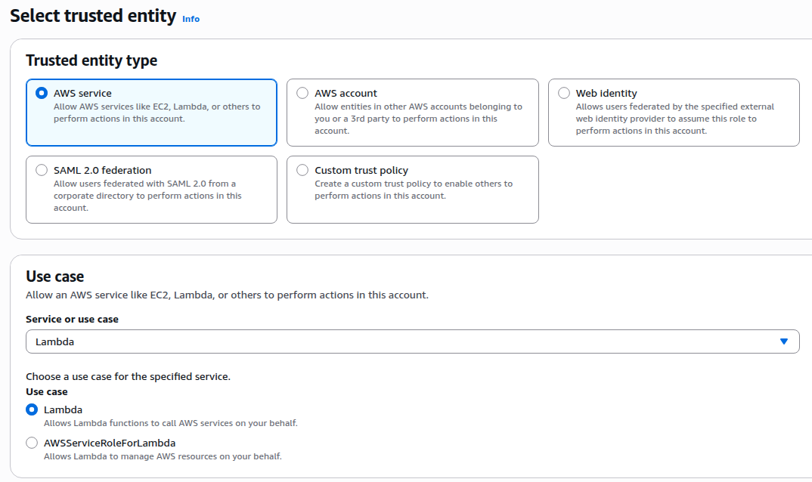

- Attach Policies: Add the following managed policies:
    - `AmazonKinesisFullAccess` (Read from Kinesis).
    - `AmazonDynamoDBFullAccess` (Write to DynamoDB).
    - `AmazonS3FullAccess` (Write to S3).
    - `AWSLambdaBasicExecutionRole` (logs en CloudWatch)

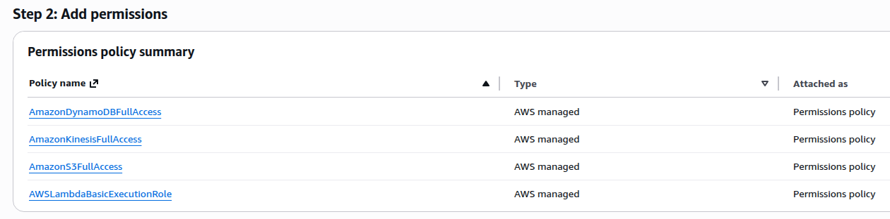

- Click Next -> Name the role `Lambda_Kinesis_DynamoDB_Role` -> Create Role.

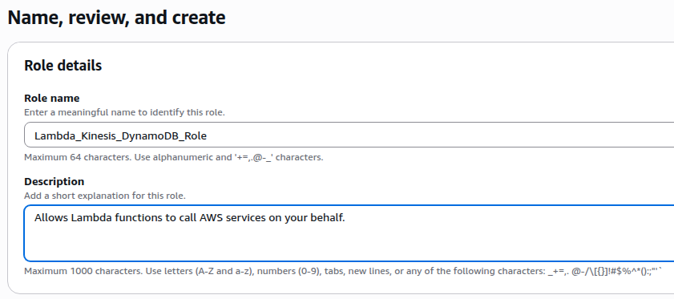

- Finalmente, veremos que nuestro rol se ha creado.

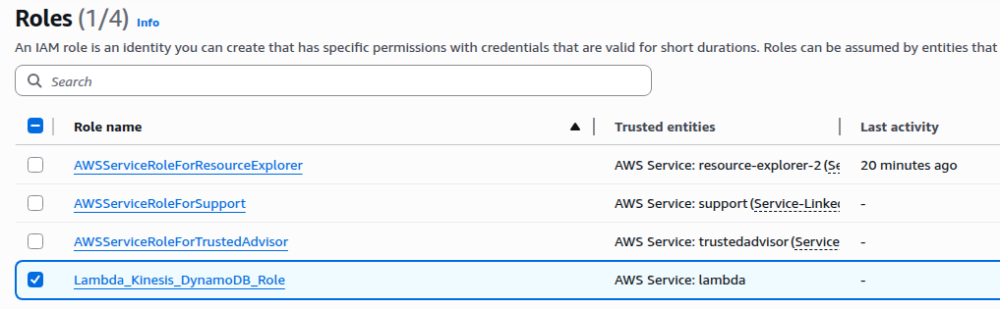

---

### 3.2.4 Configurar AWS Lambda (trigger Kinesis + código)

**¿Por qué necesitamos Lambda para el procesamiento?**

En lugar de simplemente almacenar precios de acciones sin procesar, usamos AWS Lambda para:

- Estructurar los datos -> Almacenar los datos procesados ​​en DynamoDB para una rápida recuperación.
- Calcular métricas de acciones -> Realizar un seguimiento de las variaciones de precios, los movimientos porcentuales y las medias móviles.
- Detectar anomalías -> Identificar acciones con subidas o bajadas repentinas.
- Datos sin procesar -> Almacenar los datos sin procesar en un bucket de S3.

Creamos una nueva función Lambda:

- Open AWS Console -> Navigate to Lambda.

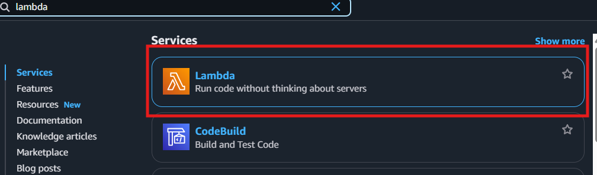

- Click Create Function -> Select Author from Scratch.
- **Function name:** `ProcessStockData`
- **Runtime:** Python 3.13
- Execution Role:  Select Use an existing role.
- Choose `Lambda_Kinesis_DynamoDB_Role` (created in the previous step).

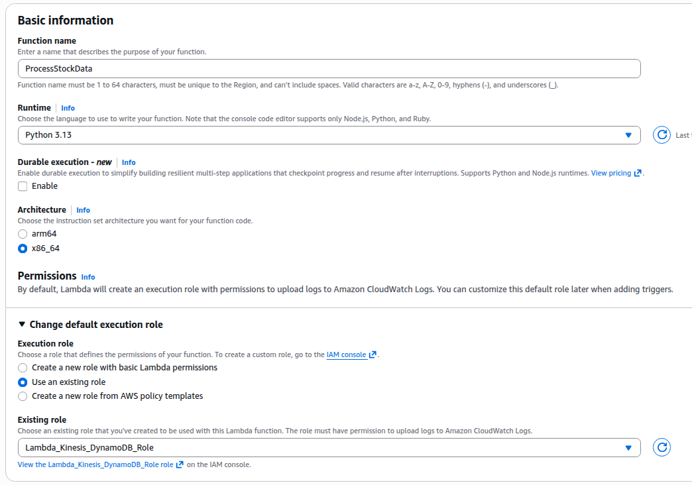

- Click Create Function.

Agregamos **Kinesis** como un Trigger
- In the Function Overview tab -> Click Add Trigger.

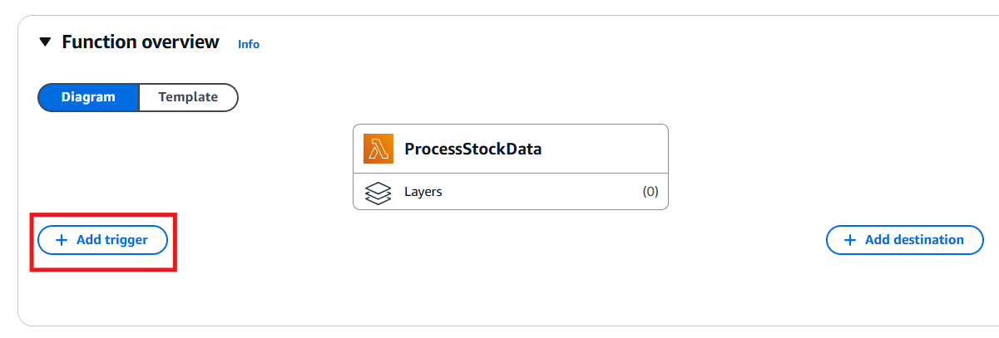

- Select Kinesis as the source -> Choose the `stock-market-stream`.

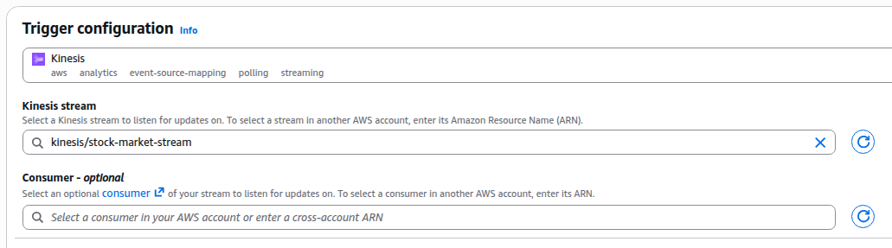

- Add a **Batch size** of 2 (la función se activa cuando se acumulan 2 registros).

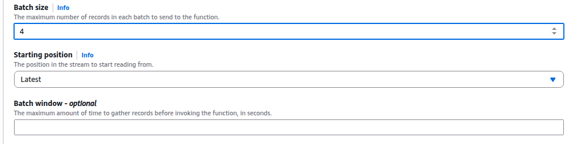

- Click Add.


**Comprender el tamaño del lote:**

- El tamaño del lote en Kinesis determina cuántos registros deben recopilarse antes de activar la función Lambda.
- Dado que enviamos registros cada 30 segundos a Kinesis, Lambda esperará a que se activen 2 registros (1 minuto).
- Por ejemplo: si la generación de registros se realiza cada 2 segundos, aumente el tamaño del lote a 10-50.

**Deploy the Lambda Code:**
- Copy the Lambda function:
[`firstLambdaFunction.py`](lambda_functions/firstLambdaFunction.py)
- Paste it into the AWS Lambda Code Editor.

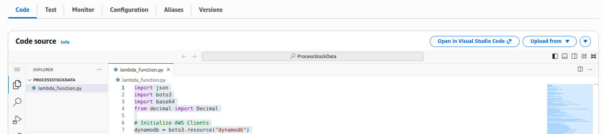

- Click Deploy.


Finalmente, se desplegó el código para:
1. Decodificar el payload de Kinesis (base64 → JSON).
2. Guardar el evento crudo en S3.
3. Calcular métricas (`change`, `change_percent`, `moving_average`).
4. Marcar anomalías si la variación absoluta supera 5%.
5. Insertar el registro procesado en DynamoDB.

---

### 3.2.5 Prueba de integración y validación

Para validar el pipeline:
- Se ejecutó el productor local (`stream_stock_data.py`) para generar eventos hacia Kinesis.

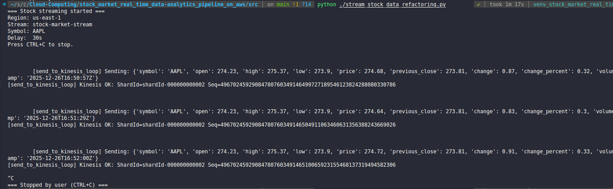

2. Se verificó la aparición de ítems en DynamoDB (Explore table items).

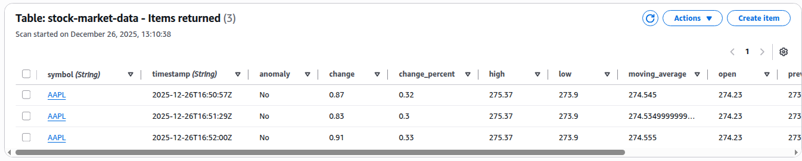

3. Se verificó la creación de archivos JSON en S3 dentro de `raw-data/`.

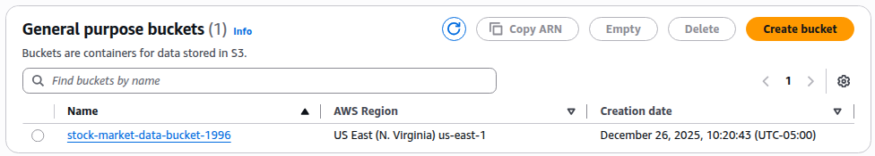

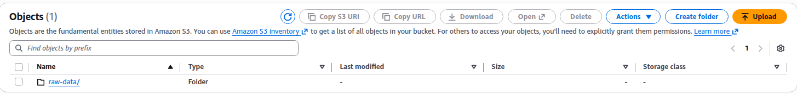

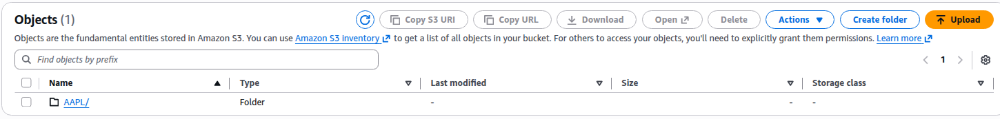

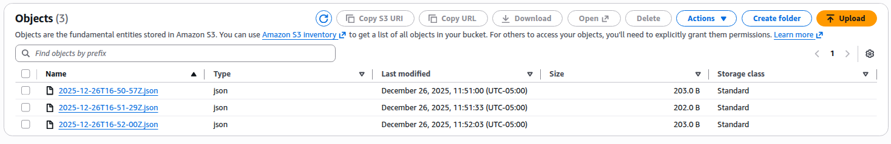


4. En caso de errores, se revisaron logs en CloudWatch desde la pestaña Monitor de Lambda.

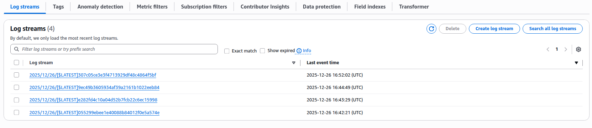

---


## 3.3 Consultar datos históricos de acciones con Amazon Athena

Pasos a seguir:

- Create a **Glue Catalog** Table for **Athena**.
- Create an **S3 Bucket** to store Query Results.
- Query Data Using **Athena**.

### 3.3.1 Create a Glue Catalog Table for Athena

Now that raw stock data is stored in Amazon S3, we will use Amazon Athena to query and analyze it efficiently.

**Why Use Amazon Athena?**

- **Serverless SQL Queries**: Query S3 data without setting up a database.
- **Cost-Effective**: Pay only for the data scanned.
- **Scalable**: Handles large datasets with ease.
- **Amazon Athena** requires a Glue Data Catalog to define the schema of S3 data.

**1. Open AWS Glue Console**
- Navigate to **AWS Console** -> Open **AWS Glue**.

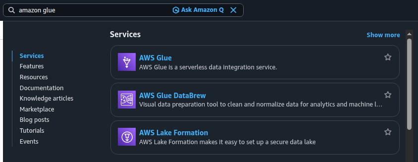

- Click **Data Catalog** → **Databases**.

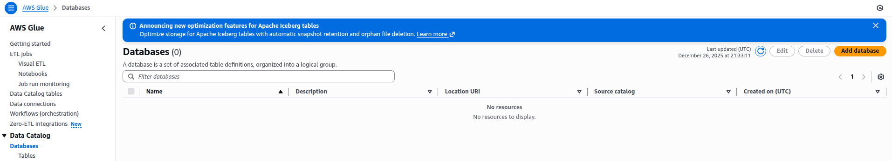

- Click Add Database.
- Database Name: `stock_data_db`
- Click Create.

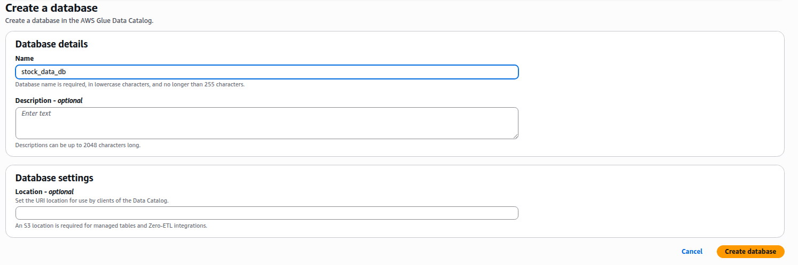

**2. Create a Table in Glue for Stock Data**

- Open **AWS Glue** Console -> Click **Tables** -> Add Table.

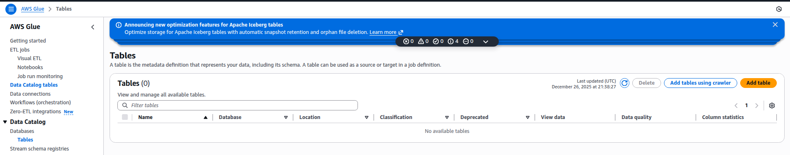

- Table Name: `stock_data_table`.
- Database: Select `stock_data_db`.

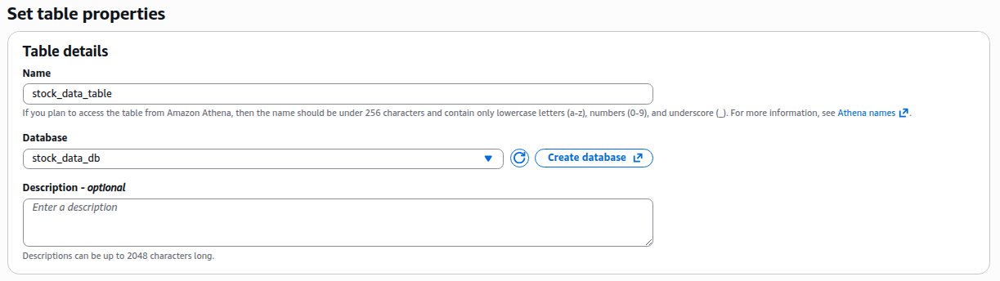

- Table Type: Choose **S3 Data**.
- S3 Path: Enter the path where **stock data** is stored, e.g.,

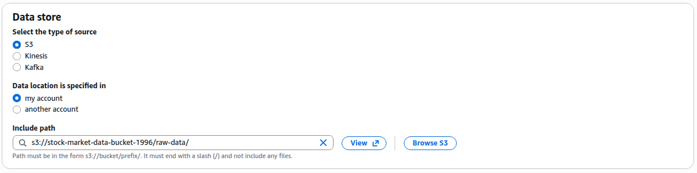

- Select JSON as the data format. Click Next.

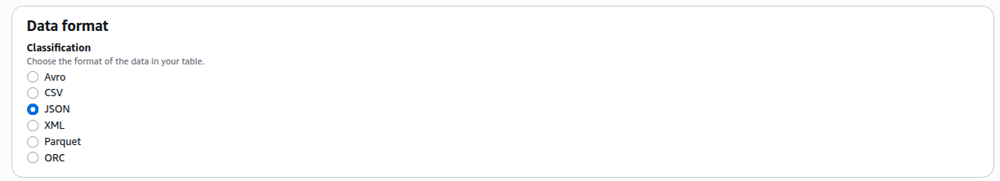

- Click Next.

**3. Define Table Schema**

- Add the following columns:

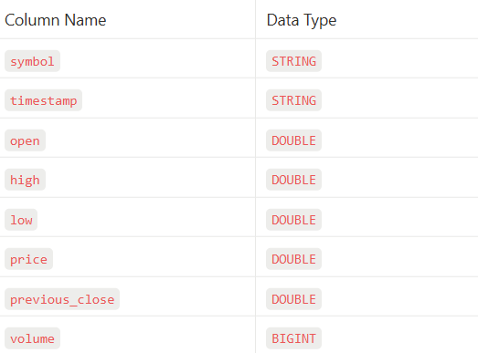

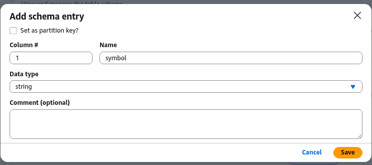

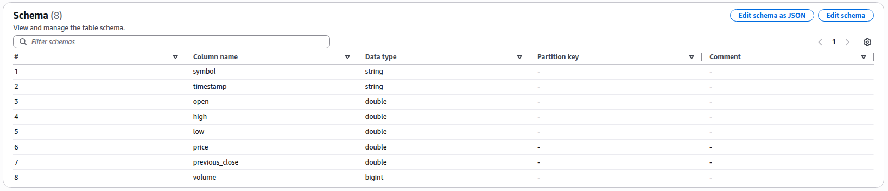

- Click Next -> Review -> **Create Table**.

### 3.3.2 Create an S3 Bucket to store Query Results

We need a S3 bucket for storing Athena query results, to create one:

- Go to AWS S3 Console -> Click "**Create Bucket**."
- Name it something like: `athena-query-results-<a-unique-id>`

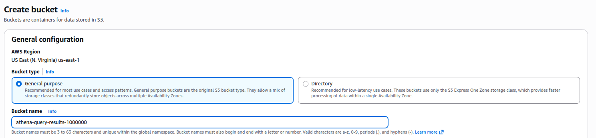

- Leave the rest as defaults.
- Click "**Create Bucket**."

### 3.3.3 Query Data Using Athena

- Open AWS Console -> Navigate to Amazon Athena.

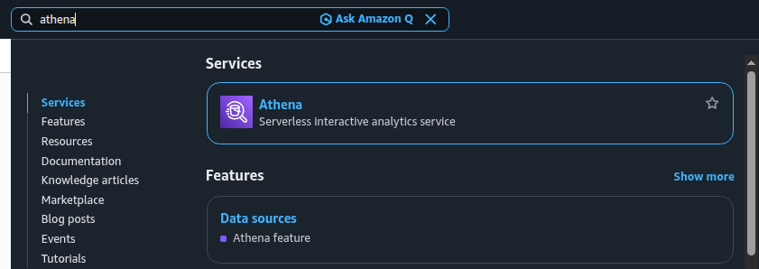

- Click- Launch Query Editor. 

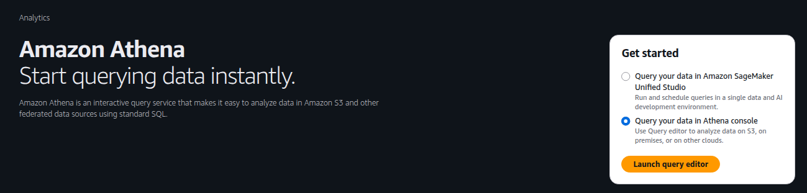

- Select stock_data_db as the database.

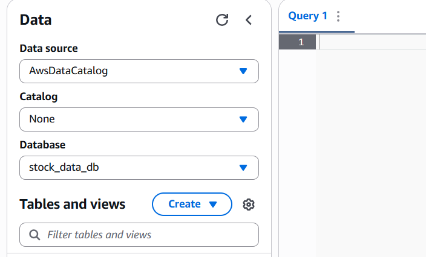

- You will get a pop-up like one given below asking to setup the query location in Amazon S3. Click on Edit Settings.

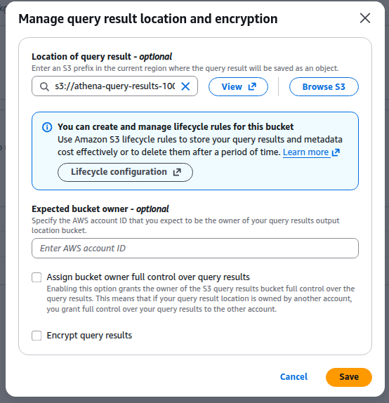

- Click Save.
- Run this SQL query to test:
```bash
SELECT * FROM stock_data_table LIMIT 10;
```
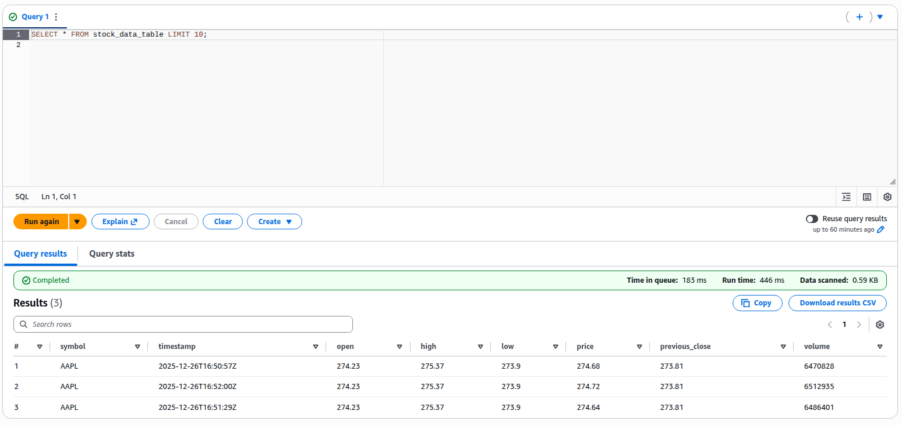

You are able a query your data through Athena! You can try retrieving data through multiple SQL queries. Lets try to run some Advanced queries.

**1. Find Top 5 Stocks with the Highest Price Change**

```bash
SELECT symbol, price, previous_close,
       (price - previous_close) AS price_change
FROM stock_data_table
ORDER BY price_change DESC
LIMIT 5;
```
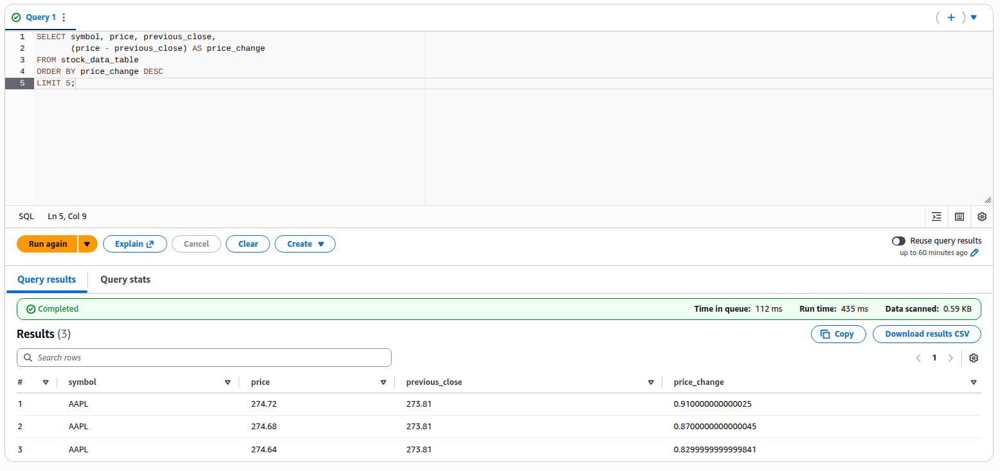

**2. Get Average Trading Volume Per Stock**

```bash
SELECT symbol, AVG(volume) AS avg_volume
FROM stock_data_table
GROUP BY symbol;
```

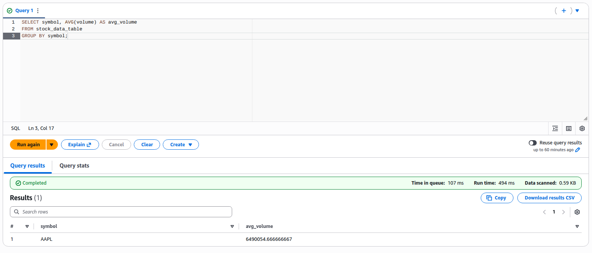

**3. Find Anomalous Stocks (Price Change > 5%)**
```bash
SELECT symbol, price, previous_close,
       ROUND(((price - previous_close) / previous_close) * 100, 2) AS change_percent
FROM stock_data_table
WHERE ABS(((price - previous_close) / previous_close) * 100) > 5;
```

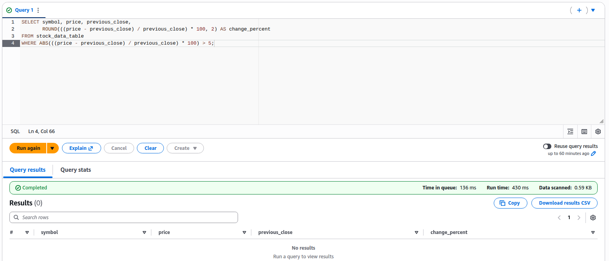

Basically, no Anomalous Stocks from the data source!

Asi mismo podemos ver que todos los resultados han sido guardados en **S3** al que le asociamos.

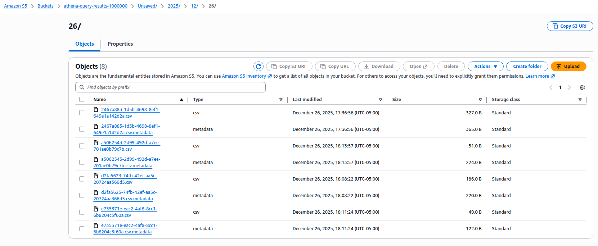

Por ejemplo para la consulta 1, el .csv respetivo contiene:

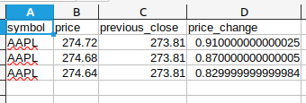

---

## 3.4 Stock trend Alerts using SNS

STEPS TO BE PERFORMED:

- Enable DynamoDB Streams.
- Create an SNS Topic.
- Create an IAM Role for Lambda.
- Create Lambda for Trend Analysis.

### 3.4.1 Enable DynamoDB Streams

Now we will set up real-time stock trend alerts using AWS services. For this, we need to:

- Enable DynamoDB Streams to capture real-time stock price changes.
- Use Amazon SNS to send notifications based on detected trends.
- Deploy an AWS Lambda function to analyze trends and trigger alerts.

DynamoDB Streams allow us to capture data changes in real time, which Lambda will analyze for trend detection

Entonces,

- Open **AWS DynamoDB Console** -> Select your table (`stock-market-data`).
- Click **Exports and Streams** -> Enable DynamoDB Streams.

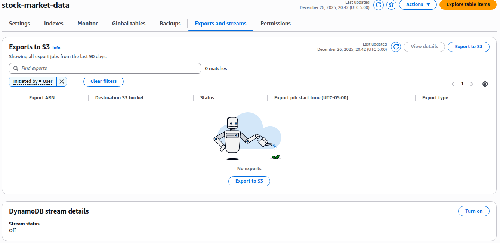

- Select **New image** (captures the latest version of the records).

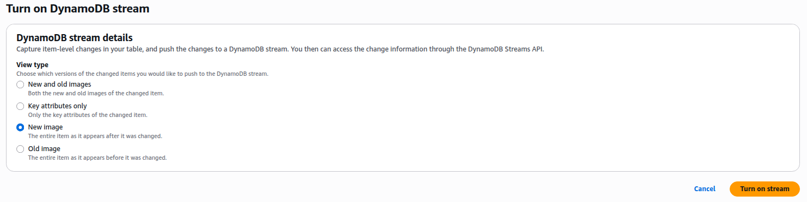

- Click Turn on stream y nos quedaría asi:

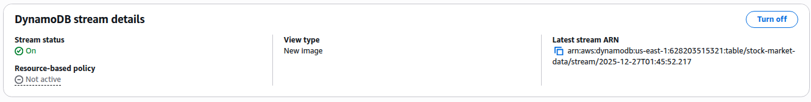

### 3.4.2 Create an SNS Topic

**Amazon SNS** (Simple Notification Service) allows us to send trend alerts via email, SMS, or other endpoints.

- Go to **AWS SNS** Console -> Create Topic.

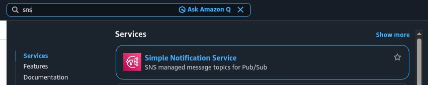

- Choose Type: Standard
- Topic name: `Stock_Trend_Alerts`

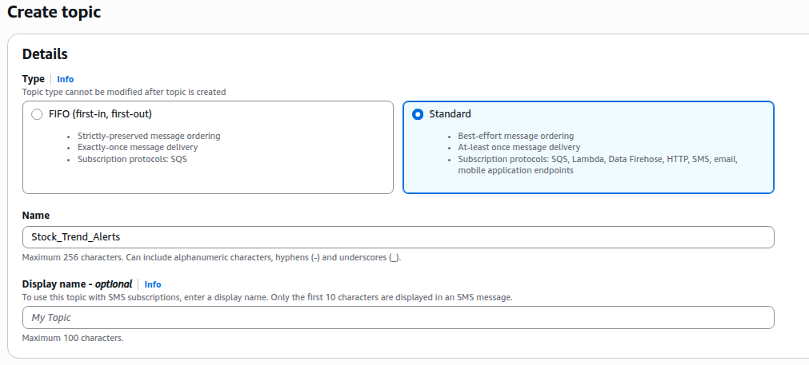

- Leave the rest as defaults. Click Create Topic.
- Add Subscribers:
    - Click Create Subscription.

    

    - Select Protocol: Email/SMS.
    - Enter the recipient email address or phone number.
    - Click on Create Subscription.

    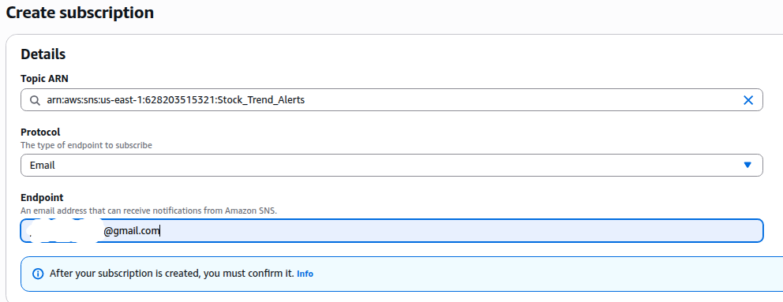

    - Confirm the subscription via the received email/SMS.

    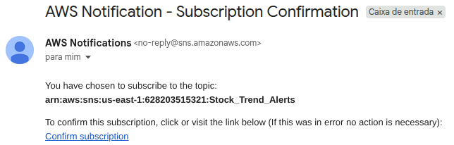

    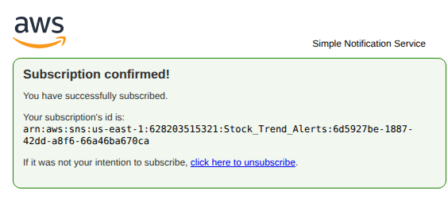

---

### 3.4.3 Create an IAM Role for Lambda

Before creating the Lambda function, we need to set up an IAM role with appropriate permissions:

- Go to **AWS IAM Console** -> Click Roles -> Click Create Role.
- Select Trusted Entity: `AWS Service, and choose Lambda`.

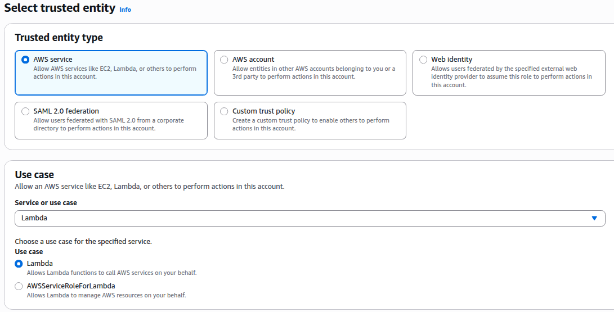

- Attach Policies:
    - `AmazonDynamoDBFullAccess` → Allows Lambda to read stock data.
    - `AmazonSNSFullAccess` → Allows Lambda to publish alerts to SNS.
    - `AWSLambdaBasicExecutionRole` → Allows CloudWatch Logs.

    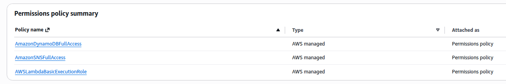

- Click Next, name the role `StockTrendLambdaRole`, and create the role.

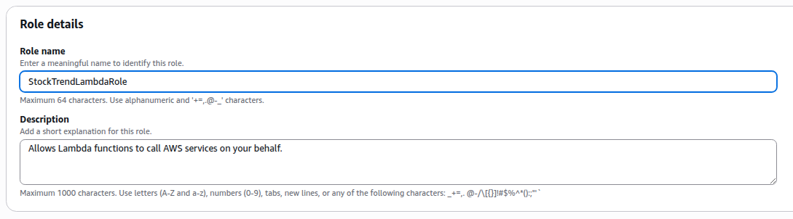

- finalmente quedando asi:

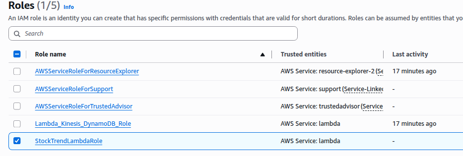

---

### 3.4.4 Create Lambda for Trend Analysis

- Go to **AWS Lambda** Console -> Create Function.
- Choose "**Author from Scratch**".|
- Function Name: `StockTrendAnalysis`
- Runtime: Python 3.13.

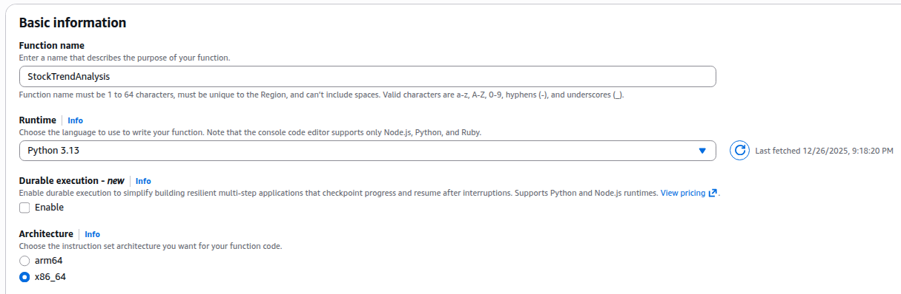

- Permissions: Choose "**Use an existing role**" and select `StockTrendLambdaRole`

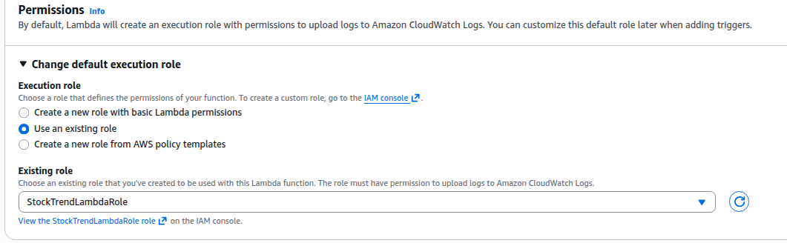

- Click Create Function.
- In the function overview, Click on Add Trigger.


- Select DynamoDB as the source.
- Choose the created DynamoDB table (`stock-market-data`).
- Modify the Batch size to 2.

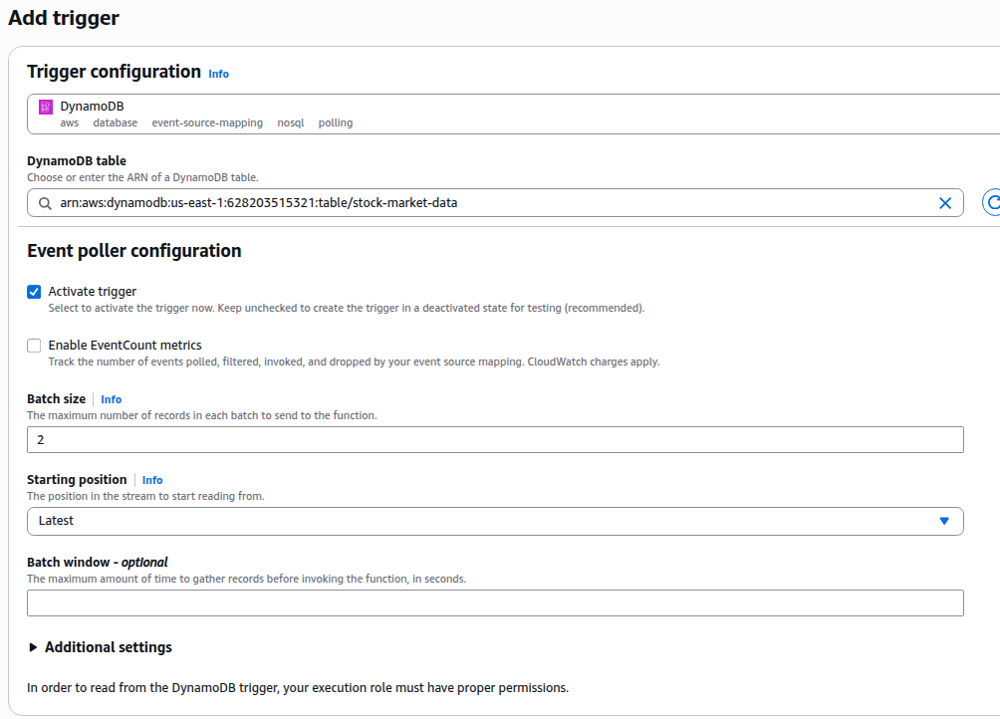

- Add the Lambda Code.

[`secondLambdaFunction.py`](lambdaFunctions/secondLambdaFunction.py)

**How is the Trend Calculated?**

- The Lambda function performs real-time trend analysis using Simple Moving Averages (SMA):

    - SMA-5 (Short-Term Moving Average) – Average stock price over the last 5 records.
    - SMA-20 (Long-Term Moving Average) – Average stock price over the last 20 records.
    - Uptrend Signal: If SMA-5 crosses above SMA-20, a BUY alert is sent.
    - Downtrend Signal: If SMA-5 crosses below SMA-20, a SELL alert is sent.

**Understanding the Lambda Code for Trend Analysis**

- Here’s a breakdown of how it works:

    - **Fetching Recent Stock Data:** The function retrieves stock prices from the last 5 minutes using get_recent_stock_data().
    It queries DynamoDB for stock records and sorts them by timestamp.

    - **Calculating Moving Averages:** The function computes SMA-5 (short-term) and SMA-20 (long-term) averages using calculate_moving_average().
    It also calculates the previous values of these SMAs to compare trends over time.

    - **Detecting Trend Reversals:** If SMA-5 crosses above SMA-20, it signals an uptrend (BUY opportunity).
    If SMA-5 crosses below SMA-20, it signals a downtrend (SELL opportunity).

    - **Sending Alerts via Amazon SNS:** If a trend shift is detected, a notification is published to an SNS topic, alerting users about potential buying or selling opportunities.
    The function handles possible SNS failures using a try-except block.

- Finalmente, Click on Deploy.

---

**Congratulations!** We have successfully completed the project- `Stock Market Real-Time Data Analytics Pipeline on AWS`.


## 3.5 Conclusion & Clean-up

**Conclusion**

This project successfully demonstrates how to build a near real-time stock market data analytics pipeline using AWS’s fully managed, serverless services. By integrating Amazon Kinesis, AWS Lambda, Amazon DynamoDB, Amazon S3, Amazon Athena, and Amazon SNS, we've created a robust and scalable architecture capable of streaming, processing, storing, analyzing, and alerting on stock data with minimal operational overhead.

**Key outcomes include:**

- **Real-time data ingestion and processing** with event-driven architecture.
- **Anomaly detection and trend alerts** using AWS Lambda and SNS.
- **Separation of raw and processed data** for efficient storage and analytics.
- **Low-cost implementation** suitable for learning and prototyping.

This hands-on lab provides practical experience with cloud-native data pipelines and offers a strong foundation for building more advanced real-time analytics systems in production environments.

**Clean-up**
- **Delete Kinesis Data Stream**:
    - Navigate to the AWS Kinesis Console -> Data Streams. Select the stock market data stream and click Delete.

- **Delete Lambda Functions:**
    - Open the AWS Lambda Console. Select the functions (`ProcessStockData, StockTrendAnalysis`). Click Delete and confirm the action.

- **Delete DynamoDB Table:**
    - Go to the DynamoDB Console. Select the `stock-market-data` table. Click Delete Table and confirm.

- **Delete SNS Topic and Subscriptions:**
    - Open the AWS SNS Console → Topics. Select the `Stock_Trend_Alerts` topic. Click Delete to remove the topic and its subscriptions.

- **Delete S3 Buckets:**
    - Navigate to the S3 Console. Select the bucket storing stock data and Athena query results. Empty the bucket first, then delete it.

- **Delete Athena Tables and Queries:**
    - Open the AWS Athena Console. Delete any tables and queries created for stock data.

- **Delete IAM Roles and Policies:**
    - Remove any IAM roles or policies specific to this project.

***NOTE***

- This project implements a near real-time data analytics pipeline rather than a fully real-time system. The stock data is streamed, processed by AWS Lambda, and stored in DynamoDB with a 30-second delay.

- The primary goal of this guide is to provide a hands-on learning experience on creating a Data Analytics pipeline while keeping AWS costs low.