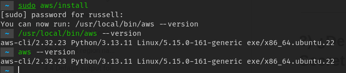
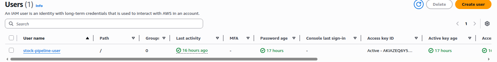
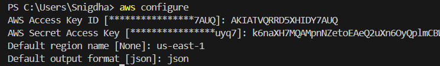
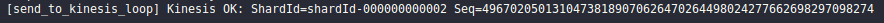
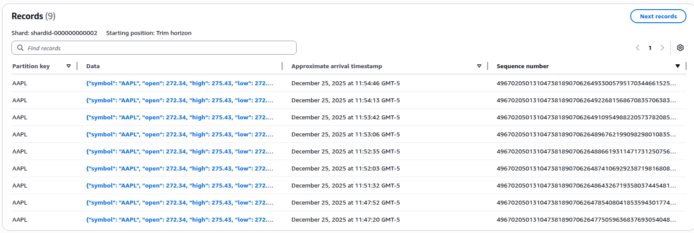

# AWS Stock Market Streaming Pipeline

# 1. Visión General del Proyecto

Este proyecto implementa un **pipeline de analítica de datos en tiempo casi real (near real-time)** utilizando **servicios serverless y orientados a eventos de AWS**, con el objetivo de ingerir, procesar, almacenar y analizar datos del mercado bursátil de manera eficiente y con conciencia de costos.

El sistema simula un escenario real de **ingesta continua de datos**, donde un productor local obtiene información actualizada del mercado desde una fuente externa y la transmite a la nube mediante un servicio de streaming administrado. A partir de este punto, la arquitectura permite el procesamiento automático de los eventos, el almacenamiento diferenciado de los datos según su propósito y la posibilidad de generar alertas ante cambios relevantes.

Aunque el dominio de aplicación corresponde al **mercado de valores**, el foco principal del proyecto no es financiero, sino **arquitectónico**. La solución está diseñada como una arquitectura de referencia que puede adaptarse fácilmente a otros tipos de datos, como señales biomédicas (por ejemplo, EEG), datos de sensores IoT, telemetría industrial o registros de sistemas. De esta forma, el proyecto sirve como una introducción práctica al diseño de **pipelines modernos de datos en la nube**.

El objetivo central es aplicar y consolidar principios fundamentales de **Cloud Architecting**, tales como:
- Arquitecturas orientadas a eventos (event-driven)
- Computación serverless
- Componentes desacoplados
- Separación del almacenamiento según el propósito
- Escalabilidad y elasticidad
- Optimización de costos bajo el modelo de pago por uso

Todo ello minimizando la gestión manual de infraestructura y la complejidad operativa.

---

# 2. Visión General de la Arquitectura

La arquitectura del proyecto sigue un **enfoque orientado a eventos**, en el cual cada nuevo dato se trata como un evento independiente que fluye a través de distintos servicios administrados de AWS. No existen servidores dedicados ni procesos persistentes en la nube; en su lugar, la solución se apoya completamente en servicios que reaccionan automáticamente a la llegada de nuevos eventos.

El flujo inicia con un **productor de datos local**, implementado en Python, que consulta periódicamente información del mercado bursátil desde Yahoo Finance. Cada lectura se transforma en un evento estructurado en formato JSON y se envía a **Amazon Kinesis Data Streams**, el cual actúa como el eje central de streaming del sistema. Kinesis permite desacoplar la generación de datos de su procesamiento, garantizando escalabilidad y tolerancia a picos de carga.

Una vez que los eventos ingresan al stream, **AWS Lambda** los consume de manera automática. Estas funciones serverless se encargan de validar, transformar y realizar análisis básicos sobre los datos, sin necesidad de aprovisionar servidores ni gestionar escalamiento. Los datos procesados, destinados a consultas rápidas, se almacenan en **Amazon DynamoDB**, mientras que los datos crudos se archivan en **Amazon S3**, conformando un data lake para análisis posteriores.

Para el análisis histórico y exploratorio, **Amazon Athena** permite ejecutar consultas SQL directamente sobre los archivos almacenados en S3, eliminando la necesidad de bases de datos analíticas dedicadas. Finalmente, cuando se detectan patrones o cambios significativos en los datos, el sistema puede emitir notificaciones en tiempo casi real mediante **Amazon SNS**, integrándose con servicios de correo electrónico o mensajería.

En conjunto, la arquitectura prioriza:
- Escalabilidad automática
- Alta disponibilidad
- Baja complejidad operativa
- Eficiencia de costos mediante servicios serverless

lo que la hace adecuada para escenarios de analítica en tiempo casi real dentro del ecosistema AWS.


---

# 3. Desarrollo del Proyecto

En esta sección se describe el desarrollo progresivo del pipeline de datos, detallando cada una de las etapas implementadas y las decisiones técnicas adoptadas. El objetivo es mostrar cómo la arquitectura presentada previamente se materializa en componentes concretos, integrados de forma incremental y coherente.

Cada subsección aborda un bloque funcional del sistema, comenzando por la ingesta de datos en tiempo casi real y avanzando hacia el procesamiento, almacenamiento, análisis y notificación de eventos.

---

## 3.1 Ingesta de Datos en Tiempo Casi Real con Amazon Kinesis

La primera etapa del desarrollo del pipeline consiste en habilitar la **ingesta continua de datos en tiempo casi real**, la cual constituye la base de toda la arquitectura orientada a eventos. En esta fase se configura un stream de Amazon Kinesis y se implementa un productor local en Python encargado de enviar datos del mercado bursátil hacia la nube de forma periódica.

Esta etapa se divide en cuatro pasos principales: la creación del stream de Kinesis, la preparación del entorno local, la implementación del script productor y la verificación del flujo de datos.

---

### 3.1.1 Creación del Kinesis Data Stream

El primer paso consiste en crear un **Amazon Kinesis Data Stream**, el cual actuará como el punto de entrada central de los datos hacia AWS. Kinesis es un servicio administrado que permite capturar y procesar grandes volúmenes de datos de streaming con baja latencia, facilitando el desacoplamiento entre productores y consumidores.

Para este proyecto, el stream se configura en **modo on-demand**, lo que elimina la necesidad de gestionar shards manualmente y permite que el servicio escale automáticamente según la carga.

**Configuración realizada:**
- **Stream name:** `stock-market-stream`
- **Capacity mode:** On-demand
- **Retention period:** 24 horas (valor por defecto)

Una vez creada la configuración, el stream queda disponible para comenzar a recibir eventos desde el productor local.


---

### 3.1.2 Preparación del Entorno Local en Python

Con el stream de Kinesis listo, el siguiente paso es preparar el **entorno local de desarrollo**, el cual será responsable de obtener los datos del mercado bursátil y enviarlos al stream.

Se utiliza **Python 3.8 o superior**
```bash
python --version
```
junto con las siguientes dependencias:
- `boto3`: SDK de AWS para Python, utilizado para interactuar con Kinesis.
- `yfinance`: biblioteca para obtener datos actualizados del mercado bursátil desde Yahoo Finance.

De preferencia creamos un entorno virtual:
```bash
python -m venv venv_stock_market_real_time
source venv venv_stock_market_real_time/bin/activate
```
Luego instalamos las librerias requeridas:
```bash
pip install boto3 yfinance
```

Asimismo, se configura la **autenticación con AWS** mediante AWS CLI, lo que permite que el SDK boto3 utilice de forma automática las credenciales del usuario para enviar datos al stream.
En un sistema operativo linux, hacemos:
```bash
sudo apt update
sudo apt install -y curl unzip
```
Descargamos AWS CLI v2(oficial)
```bash
curl "https://awscli.amazonaws.com/awscli-exe-linux-x86_64.zip" -o "awscliv2.zip"
```

Descomprimimos e instalamos:
```bash
unzip awscliv2.zip
sudo ./aws/install
```


Creamos un usuario, configuramos los permisos y descargamos el Access key ID y el  Secret access key para hacer:



```bash
aws configure
```



Este paso asegura que el entorno local tenga:
- Acceso autenticado a AWS.
- Permisos suficientes para interactuar con Amazon Kinesis.
- Dependencias necesarias para la obtención y envío de datos.

---

### 3.1.3 Implementación del Script Productor de Datos

Una vez configurado el entorno, se implementa un **script productor en Python** encargado de obtener datos del mercado bursátil y enviarlos continuamente a Amazon Kinesis.

El script realiza las siguientes tareas:
1. Consulta datos del símbolo bursátil `AAPL` utilizando la biblioteca `yfinance`.
2. Obtiene información relevante como precios de apertura, máximo, mínimo, cierre, volumen y cierre previo.
3. Calcula métricas básicas como el cambio absoluto y el porcentaje de variación.
4. Estructura la información en un objeto JSON que incluye una marca temporal en UTC.
5. Envía el evento al stream de Kinesis utilizando `put_record`, empleando el símbolo bursátil como **Partition Key** para preservar el orden de los eventos.

**Python streaming script:**  
[`stream_kinesis.py`](src/stream_stock_data_refactoring.py)

El script se ejecuta en un bucle infinito con un intervalo de 30 segundos entre envíos, simulando un flujo continuo de datos en tiempo casi real.

---

### 3.1.4 Ejecución y Verificación del Flujo de Datos

Finalmente, se ejecuta el script productor desde la terminal para comenzar el envío de datos hacia Amazon Kinesis. Cada ejecución genera un nuevo evento que es enviado al stream y confirmado mediante la respuesta del servicio.

Durante la ejecución, el script imprime en consola:
- El contenido del evento enviado.


- La respuesta de Kinesis, incluyendo el `ShardId`, el `SequenceNumber` y el código HTTP 200, indicando un envío exitoso.




Para verificar que los datos están llegando correctamente a AWS, se utiliza la consola de Amazon Kinesis, revisando:
- Las métricas de **Incoming Records** en la sección *Monitoring*.
- Opcionalmente, el **Data Viewer** para inspeccionar los registros almacenados en los shards.




Es importante detener manualmente la ejecución del script utilizando `CTRL + C` cuando no se requiera continuar enviando datos, ya que mantener el productor activo de forma indefinida nos puede generar costos innecesarios.


---

Con esta etapa se completa la ingesta de datos en tiempo casi real, dejando el pipeline preparado para que servicios posteriores, como AWS Lambda, consuman los eventos del stream y continúen con el procesamiento y almacenamiento de la información.


